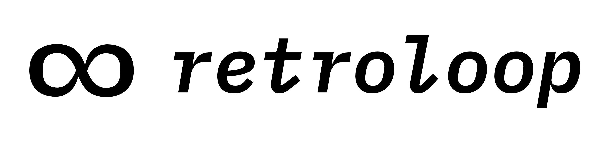

<!-- PROJECT LOGO -->

   

<h3 align="center">
  <a href="https://retroloop.io" rel="noopener">retroloop.io</a>
</h3>

  

  

Retroloop is an easy to use tool for conducting agile retrospectives.

